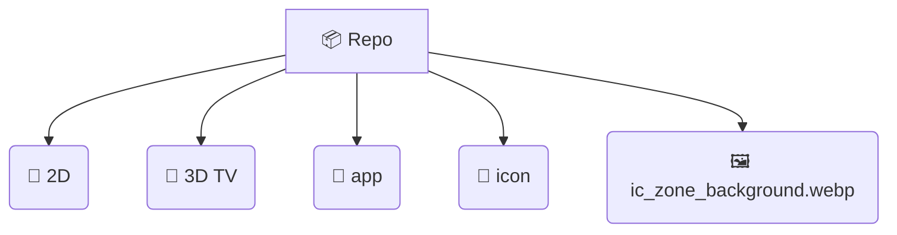

<div align="center">

# SHARE TÀI NGUYÊN THIẾT KẾ BILIBLI 
### Tài nguyên vẫn đang được cập nhật


[](https://github.com/niyakipham)
[](https://www.bilibili.com/)
[](https://github.com/niyakipham/bilibili/)

<br/>

</div>

## 🎨 **1. GIỚI THIỆU (INTRODUCTION)**

Chào mừng đến BRO với repo này tổng hợp từ **Bilibili** - Nền tảng video và văn hóa Anime/Game hàng đầu tại tung của. Repo này cung cấp các assets như png, jpg,... phục vụ cho mục đích **nghiên cứu/tham khảo**.

<br>


## 📂 **2. CẤU TRÚC (REPOSITORY STRUCTURE)**

Dưới đây là cấu trúc của dự án



<br>


## 🚀 **3. CÁCH SỬ DỤNG (HOW TO USE)**

Bạn dùng clone hoặc tải file zip về đều được

```bash
git clone https://github.com/niyakipham/bilibili.git
cd bilibili
```

<br>

## ⚠️ **4. TUYÊN BỐ MIỄN TRỪ TRÁCH NHIỆM (DISCLAIMER)**

> **🔴 LƯU Ý QUAN TRỌNG:**
>
> 1.  Toàn bộ bản quyền hình ảnh, logo, và thiết kế thuộc về **Bilibili Inc.**
> 2.  Repo này chỉ nhằm mục đích **chia sẻ, lưu trữ và học tập**.
> 3.  Vui lòng **KHÔNG** sử dụng cho các sản phẩm thương mại hoặc mạo danh Bilibili.
> 4.  Do lười phân loại nên mình là các file trông rất lộn xộn mọi người chú ý giúp mình nha

<br>

## 🤝 **6. ĐÓNG GÓP & ỦNG HỘ (CONTRIBUTE & DONATE)**

Nếu bạn có thêm các tài nguyên mới hoặc muốn đóng góp để kho tàng này phong phú hơn, hoặc tạo **Pull Request** để đóng góp cho dự án nhé nhé! <br>

☕ **Mời tôi một ly cà phê để có thêm động lực cập nhật nhé:**

<br>

<div align="center">
  <a href="https://niyakipham.is-a.dev/donate/">
    
  </a>
</div>

<br/>

<div align="center">
  <sub>Built with ❤️ by <a href="https://github.com/niyakipham">Niyaki Pham</a></sub>
</div>


